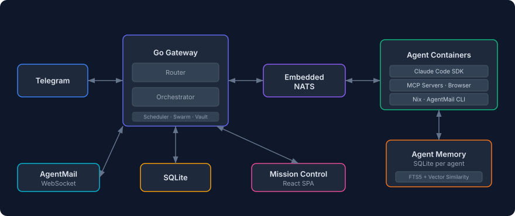

# Praktor

Personal AI agent assistant. A single Go binary that receives messages from Telegram, routes them to named ADK/VLLM-backed agents running in isolated Docker containers, and serves a real-time Mission Control web UI. Self-hosted, single-binary deployment via Docker Compose.

<p align="center">
  
</p>

## Features

- **Mission Control** — Real-time dashboard with WebSocket updates
- **Telegram I/O** — Chat with your agents from your phone
- **Telegram commands** — `/start`, `/stop`, `/reset`, `/nix`, `/agents`, `/commands`
- **Named agents** — Multiple agents with distinct roles, models, and configurations
- **Smart routing** — `@agent_name` prefix or AI-powered classification via the default agent
- **Per-agent isolation** — Each agent runs in its own Docker container with its own filesystem
- **Persistent memory** — Per-agent SQLite memory database with hybrid search (FTS5 keyword + vector semantic similarity via all-MiniLM-L6-v2) for storing and recalling facts across sessions
- **Agent identity** — Each agent has an `AGENT.md` for personality and expertise, editable from Mission Control or by agents themselves
- **User profile** — Agents know who you are via `USER.md`, editable from Mission Control or by agents themselves
- **Scheduled tasks** — Cron, interval, or one-shot jobs that run agents and deliver results via Telegram. Multiple tasks execute in parallel (up to 3 concurrent) with independent sessions
- **Secure vault** — AES-256-GCM encrypted secrets injected as env vars or files at container start, never exposed to the LLM
- **Web & browser access** — Agents can search the web and automate browsers via [agent-browser](https://github.com/vercel-labs/agent-browser)
- **Voice messages** — Send voice messages in any language; they're transcribed via OpenAI Whisper and delivered as text. Optional TTS replies voice messages back using OpenAI TTS
- **Email via AgentMail** — Agents can send and receive email via [AgentMail](https://agentmail.to/). Configure an inbox per agent and the gateway handles real-time email routing
- **Hot config reload** — Edit `praktor.yaml` and changes apply automatically, no restart needed
- **Nix package manager** — Agents can install packages on demand (Python, ffmpeg, LaTeX, etc.) via MCP tools or the `/nix` Telegram command
- **Agent extensions** — Per-agent MCP servers, plugins, and skills, managed via Mission Control
- **Agent swarms** — Graph-based multi-agent orchestration with fan-out, pipeline, and collaborative patterns
- **Backup & restore** — Back up and restore all Docker volumes as zstd-compressed tarballs via CLI

## Prerequisites

- Docker and Docker Compose
- A Telegram bot token ([create one with @BotFather](https://t.me/BotFather))
- An OpenAI-compatible vLLM endpoint, or a Google ADK/Gemini API key
- (Optional) An [OpenAI API key](https://platform.openai.com/api-keys) for voice message transcription and text-to-speech

## Getting Started

### 1. Clone and Configure

```sh
git clone https://github.com/dbphx/fork-praktor.git
cd fork-praktor
cp config/praktor.example.yaml config/praktor.yaml
cp .env.example .env && chmod 0600 .env
```

Edit `.env` and fill in your credentials (see comments in the file for details). The gateway needs access to `/var/run/docker.sock` so it can create agent containers. The default `PRAKTOR_RUN_USER=0:0` works on a normal Docker host.

If you change `PRAKTOR_RUN_USER` to a non-root user, set `DOCKER_GID` to the group ID of the `docker` group on that host:

```sh
grep docker /etc/group    # look for the docker group GID
```

Backend selection is controlled by `AGENT_BACKEND`:

```env
AGENT_BACKEND=auto
```

In `auto` mode, Praktor uses ADK when vLLM/OpenAI-compatible or Gemini credentials are present (`VLLM_BASE_URL`, `VLLM_API_KEY`, `ADK_MODEL`, `GEMINI_API_KEY`, or `GOOGLE_API_KEY`). If those are not configured but `ANTHROPIC_API_KEY` or `CLAUDE_CODE_OAUTH_TOKEN` is present, it uses the Claude Agent SDK fallback. You can force either path with `AGENT_BACKEND=adk` or `AGENT_BACKEND=claude`.

Edit `config/praktor.yaml` to define your agents:

```yaml
telegram:
  allow_from: []            # Telegram user IDs (empty = allow all)
  main_chat_id: 0           # Chat ID for scheduled task / swarm results

defaults:
  model: "vllm/gemma4-12b"
  max_running: 5
  idle_timeout: 10m

agents:
  general:
    description: "General-purpose assistant for everyday tasks"
    nix_enabled: true
  coder:
    description: "Software engineering specialist"
    model: "vllm/gemma4-12b"
    nix_enabled: true
    env:
      GITHUB_TOKEN: "secret:github-token"    # Resolved from vault
  researcher:
    description: "Web research and analysis"
    allowed_tools: [WebSearch, WebFetch, Read, Write]

router:
  default_agent: general
```

### 2. Build and Run

```sh
docker compose --profile build build fork-agent
docker compose up -d --build
docker compose logs -f
```

The gateway, agent base, and agent runner images are built from the local source tree. The agent image skips the Claude Code binary by default because ADK/vLLM does not need it; set `INSTALL_CLAUDE_CODE=true` in `.env` only when you want Claude SDK fallback.

Mission Control is available at `http://localhost:8081`.

Agent harness files live in `agents/`. Each workspace can include `AGENT.md`, `CLAUDE.md`, notes, scripts, or other starter files. On agent start, Praktor seeds files that are missing from the corresponding Docker workspace volume without overwriting files the agent has already created.

### Run One Service on Another Machine

On a fresh machine, clone the repo, create `.env` and `config/praktor.yaml`, then build the two agent images once before starting the gateway:

```sh
git clone https://github.com/dbphx/fork-praktor.git
cd fork-praktor
cp config/praktor.example.yaml config/praktor.yaml
cp .env.example .env && chmod 0600 .env
```

Fill `.env` with your Telegram token, vault passphrase, web password, and vLLM/ADK credentials. Keep `PRAKTOR_RUN_USER=0:0` unless you have configured a non-root user that can access `/var/run/docker.sock`.

For `log_analyzer`, keep `LOG_API_URL` in `.env` and store the bearer token in the encrypted vault after the gateway starts:

```sh
docker compose exec fork-praktor /praktor vault set log-api-key --value "<KEY>" --description "Log API Bearer token"
docker compose exec fork-praktor /praktor vault assign log-api-key --agent log_analyzer
```

Build local images:

```sh
docker compose --profile build build fork-agent
```

For ADK/vLLM deployments, keep `INSTALL_CLAUDE_CODE=false` so the build does not wait on the Claude Code binary download.

Run only the gateway service:

```sh
docker compose up -d --build fork-praktor
docker compose logs -f fork-praktor
```

Only `fork-praktor` should stay running as the Compose service. Agent containers such as `fork-praktor-agent-general` are created on demand by the gateway when a chat message arrives, using the local `fork-praktor-agent:latest` image.

If `go mod download` fails during Docker build because `proxy.golang.org` resets long downloads, set an alternate module proxy in `.env` and rebuild:

```env
GOPROXY=https://goproxy.io,direct
```

```sh
docker compose build fork-praktor
```

### 3. Start Chatting

Open Telegram and send a message to your bot. Praktor routes it to the right agent, spins up a container, and responds. Use `@agent_name` to target a specific agent, or let smart routing classify the message automatically:

```
Hello!                              → smart routing picks best agent
@coder fix the login bug            → explicit routing to coder
@researcher find papers on RAG      → explicit routing to researcher
```

Routing works in 3 tiers: `@agent_name` prefix → AI-powered classification via default agent → default agent fallback.

For a secure setup without exposed ports, see [Production Deployment](https://github.com/dbphx/fork-praktor/wiki/Production-Deployment).

## Upgrading

Pull the latest code and rebuild the local images:

```sh
./scripts/upgrade.sh
```

Then restart the stack:

```sh
docker compose up -d
```

## Documentation

See the **[Wiki](https://github.com/dbphx/fork-praktor/wiki)** for detailed documentation on all features:

[Hot Config Reload](https://github.com/dbphx/fork-praktor/wiki/Hot-Config-Reload) · [Vault](https://github.com/dbphx/fork-praktor/wiki/Vault) · [Voice Messages](https://github.com/dbphx/fork-praktor/wiki/Voice-Messages) · [Browser Automation](https://github.com/dbphx/fork-praktor/wiki/Browser-Automation) · [AgentMail](https://github.com/dbphx/fork-praktor/wiki/AgentMail) · [Agent Extensions](https://github.com/dbphx/fork-praktor/wiki/Agent-Extensions) · [Agent Swarms](https://github.com/dbphx/fork-praktor/wiki/Agent-Swarms) · [Nix Package Manager](https://github.com/dbphx/fork-praktor/wiki/Nix-Package-Manager) · [Backup & Restore](https://github.com/dbphx/fork-praktor/wiki/Backup-and-Restore) · [Production Deployment](https://github.com/dbphx/fork-praktor/wiki/Production-Deployment)

## Getting Help

After cloning the repo, configure your vLLM or ADK credentials in `.env`, then use Mission Control or Telegram to interact with your agents. The project includes a detailed `CLAUDE.md` for development context and architecture notes.

```sh
git clone https://github.com/dbphx/fork-praktor.git
cd fork-praktor
cp config/praktor.example.yaml config/praktor.yaml
cp .env.example .env && chmod 0600 .env
```

For example, you can ask agents things like:

- "How do I install an MCP server on a Praktor agent?"
- "How do I add a new agent to my configuration?"
- "How do I set up secrets for an agent?"

## Development

### Toolchain (mise)

Local tooling is pinned in `mise.toml`. With [mise](https://mise.jdx.dev) installed, run:

```sh
mise install                 # Provision go, golangci-lint, node, nats, jq
```

This matches the versions used in CI, so `make lint` and `go test` behave identically locally and on GitHub Actions. `sqlite3` is expected from the system package manager.

### Common commands

```sh
go mod download              # Install Go dependencies
make dev                     # Run the gateway locally
make test                    # Run tests
make lint                    # Run golangci-lint
```

Mission Control with hot reload:

```sh
cd ui && npm install && npm run dev    # Vite dev server on :5173, proxies /api to :8080
```

## License

See [LICENSE](LICENSE).

## Third-Party Notice

This project integrates with third-party tools and model providers that have their own licenses and terms of service. You are responsible for complying with the terms of your configured vLLM, Google ADK/Gemini, OpenAI, AgentMail, and browser automation providers.
